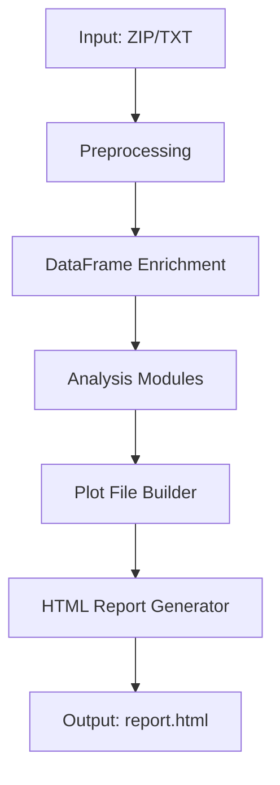
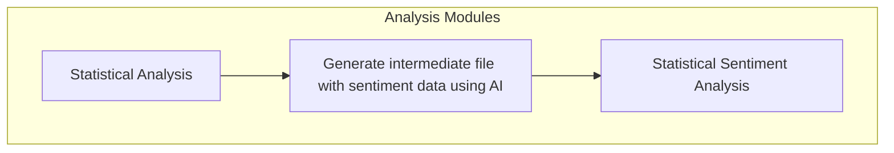
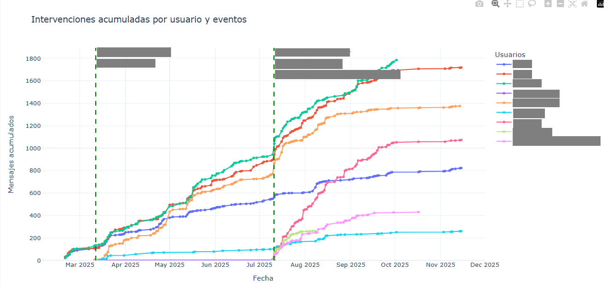
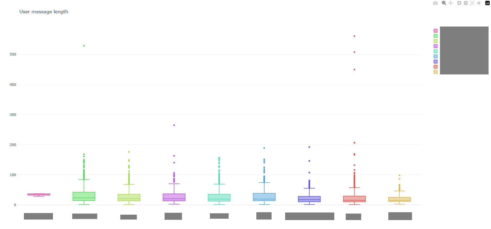
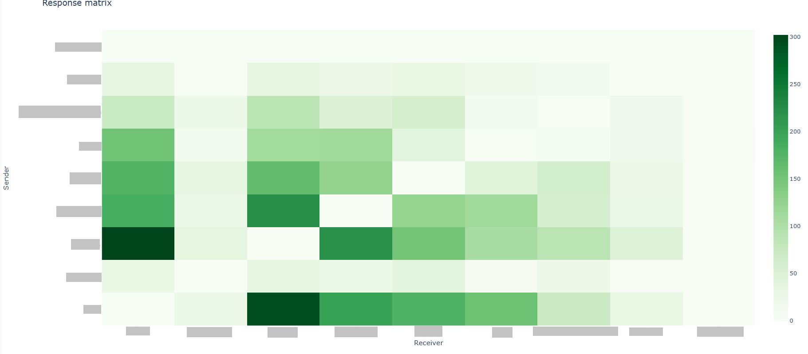
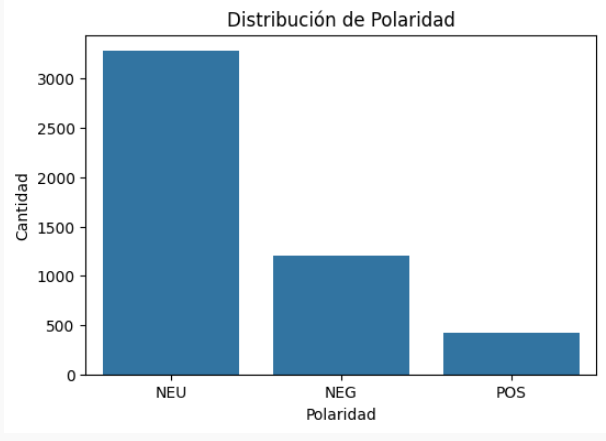
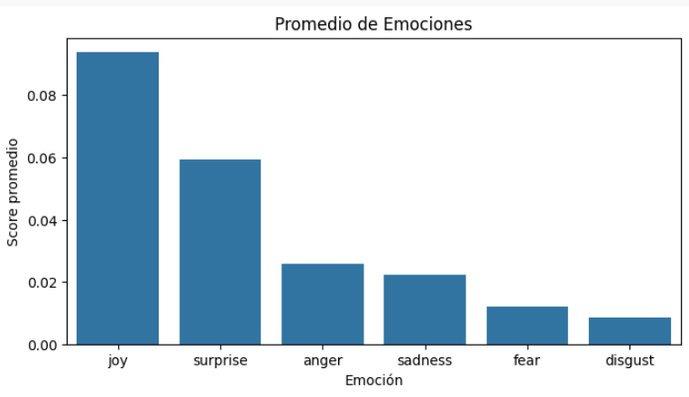
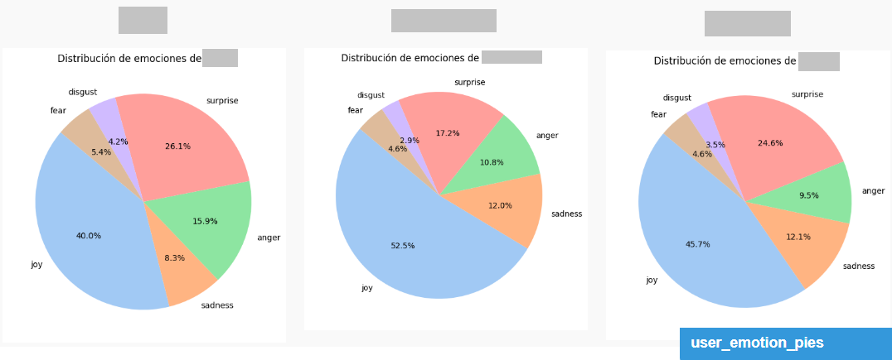

# WhatsApp Chat Analyzer – README
## 📌 Overview

This script processes, cleans, and analyzes WhatsApp chats to automatically generate a complete interactive HTML report.
It extracts rich conversational insights through:

User participation analysis

Message frequency and activity patterns

Group events (joins, leaves, removals)

Sentiment analysis and emotion detection

Emoji statistics and word frequency analysis

Topic modeling using LDA

Response flows and interaction networks

Multimedia statistics

Longest messages, conversation openings/closures, and many other metrics

The output is a highly visual report containing tables, heatmaps, timelines, histograms, word clouds, and interactive Plotly charts.

🚀 How to Use
### 1. Prepare the folder structure

Your project should contain:
```css
BASE_DIR/
 ├─ input/        → WhatsApp exported ZIP files + phone_map.csv
 ├─ chats/        → Normalized .txt files (auto-generated)
 ├─ output/       → Final HTML reports
 ├─ formatting_utils.py
 ├─ sentiment_utils.py
 ├─ normalize_utils.py
 ├─ lda_utils.py
 ├─ utils.py
 └─ your_script.py
```
### 2. (Optional) Add phone number → username mapping

Place a CSV file in input/phone_map.csv:
```css
tel,name
+1234567890,Alice
+0987654321,Bob
```
### 3. Run the script
python your_script.py


The script will:

Normalize all WhatsApp ZIP exports found in /input

Process every generated .txt file in /chats

Create one HTML report per chat inside /output

Each report will have collapsible sections, an index menu, and interactive charts.

## 🛠️ What the Script Does Step by Step



## Below are example plots generated from user messages. These visualizations show activity patterns, message length distributions, and sentiment/emotion analysis.

  
*Plot 1: User activity over time, showing messages per day and important events like users leaving or entering chat*

  
*Plot 2: whisker chart that represents message lenght per user.*

  
*Plot 3: Heatmap showing interactions between users.*
This is calculated by counting responses between users.
(This will be used in the future to map subgroups of friends inside chat members)

  
*Plot 4: Polarity of all group chat messages*

  
*Plot 5: Emotions of all groupm messages*

  
*Plot 6: Timeline of emotions detected in messages (joy, anger, sadness, etc.).*

  
*Plot 7: Sentiment distribution per user (joy, fear, sadness).*


## Requirements.txt description

Python Requirements Overview

* pandas>=2.0,<2.4
For handling and analyzing structured data (DataFrames). Core library for loading, cleaning, and enriching chat data.

* regex>=2023.6.3
Advanced regular expressions for text parsing, cleaning messages, detecting patterns.

* emoji>=2.3.0
To detect, extract, and count emojis in messages for emoji analysis.

* matplotlib>=3.6.0,<4.0
Base plotting library for static charts (used alongside seaborn).

* seaborn>=0.13.0,<0.15
High-level statistical plotting library; simplifies creating attractive plots (e.g., activity distributions, boxplots).

* plotly>=5.10.0,<6.0
Interactive plotting library; used for generating interactive time-series charts, heatmaps, and other dynamic visuals.

* wordcloud>=1.8.2,<2.0
Generates word clouds from message text to visualize frequently used words.

* networkx>=3.1,<4.0
For building and analyzing interaction networks (who replies to whom, flow diagrams).

* pyLDAvis>=3.3.1,<4.0
Visualizing topic models (LDA) interactively.

* transformers>=4.30.0,<5.0
NLP models (e.g., BERT) for sentiment and emotion analysis on messages.

* tqdm>=4.65.0,<5.0
Progress bars for loops, useful for long-running processing on large chats.

* pysentimiento>=0.7.0,<1.0
Sentiment and emotion analysis library for Spanish and other languages; key for emotion extraction.

* nltk>=3.8.0,<4.0
Natural Language Toolkit; tokenization, stopwords, basic NLP preprocessing.

* gensim>=4.3.0,<5.0
Topic modeling (LDA) and other vector-space representations of text.

* scipy>=1.10.0,<2.0
Scientific computing library; statistics, distributions, and numerical methods.

* whatstk>=0.7.0,<1.0
WhatsApp-specific chat toolkit for parsing .txt exports and converting to structured format.
