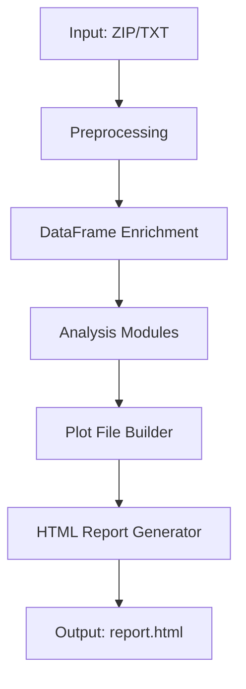
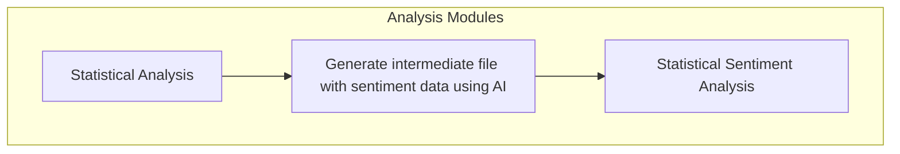

# WhatsApp Chat Analyzer – README
## 📌 Overview

This script processes, cleans, and analyzes WhatsApp chats to automatically generate a complete interactive HTML report.
It extracts rich conversational insights through:

User participation analysis

Message frequency and activity patterns

Group events (joins, leaves, removals)

Sentiment analysis and emotion detection

Emoji statistics and word frequency analysis

Topic modeling using LDA

Response flows and interaction networks

Multimedia statistics

Longest messages, conversation openings/closures, and many other metrics

The output is a highly visual report containing tables, heatmaps, timelines, histograms, word clouds, and interactive Plotly charts.

🚀 How to Use
### 1. Prepare the folder structure

Your project should contain:
```css
BASE_DIR/
 ├─ input/        → WhatsApp exported ZIP files + phone_map.csv
 ├─ chats/        → Normalized .txt files (auto-generated)
 ├─ output/       → Final HTML reports
 ├─ formatting_utils.py
 ├─ sentiment_utils.py
 ├─ normalize_utils.py
 ├─ lda_utils.py
 ├─ utils.py
 └─ your_script.py
```
### 2. (Optional) Add phone number → username mapping

Place a CSV file in input/phone_map.csv:
```css
tel,name
+1234567890,Alice
+0987654321,Bob
```
### 3. Run the script
python your_script.py


The script will:

Normalize all WhatsApp ZIP exports found in /input

Process every generated .txt file in /chats

Create one HTML report per chat inside /output

Each report will have collapsible sections, an index menu, and interactive charts.

## 🛠️ What the Script Does Step by Step



## Below are example plots generated from user messages. These visualizations show activity patterns, message length distributions, and sentiment/emotion analysis.

  
*Plot 1: User activity over time, showing messages per day.*

  
*Plot 2: Cumulative messages per user throughout the chat.*

  
*Plot 3: Heatmap showing message frequency by hour of the day.*

  
*Plot 4: Distribution of message lengths per user.*

  
*Plot 5: Most frequent words used in the conversation.*

  
*Plot 6: Timeline of emotions detected in messages (joy, anger, sadness, etc.).*

  
*Plot 7: Sentiment distribution per user (positive, negative, neutral).*
